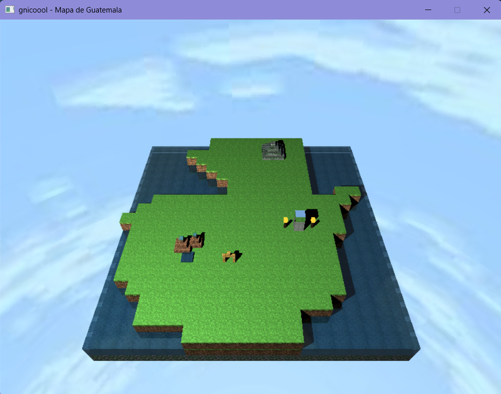

# Raytracing-Proyect

Diorama en 3D renderizado con un raytracer propio en Rust, inspirado en Guatemala. La escena principal es un mapa en relieve del país que conecta, mediante marcadores interactivos, con dioramas de algunos de sus lugares más emblemáticos: Tikal, el Lago de Atitlán, el Arco de Antigua Guatemala y el Castillo de San Felipe.

## Ver video

[](https://youtu.be/lb9j1y0TWEQ)

## Vistas disponibles

| Vista | Tecla | Descripción |
|---|---|---|
| Mapa de Guatemala | `M` | Vista inicial. Mapa en relieve del país con réplicas en miniatura de las demás vistas; chocar la cámara contra cada réplica teletransporta a esa vista. |
| Castillo de San Felipe | `0` | Diorama del castillo: base de madera, pilares de hierro y techo de hierro espejo sobre una superficie de hielo/agua. Vista por defecto antes de incorporarse el Mapa de Guatemala. |
| Lago de Atitlán | `I` | Volcanes de piedra, gran superficie de agua con reflexión/refracción, muelles y balsa de madera. |
| Antigua Guatemala | `O` | Calle empedrada y el Arco de Santa Catalina, con la torre en hierro espejo que refleja el entorno. |
| Tikal y la selva | `P` | Pirámide maya escalonada rodeada de selva densa con follaje transparente. |

Además de las teclas, dentro del **Mapa de Guatemala** puedes navegar chocando la cámara contra los marcadores:
- Las réplicas miniatura de Tikal, Atitlán, Antigua Guatemala y Castillo de San Felipe te llevan a esa vista.
- Desde cualquier otra vista, chocar con la bandera de Guatemala te regresa al Mapa.

## Controles

Todo el control es por teclado (no hay soporte de mouse).

| Tecla | Acción |
|---|---|
| `↑` `↓` `←` `→` | Orbitar la cámara alrededor del centro de la escena (pitch/yaw) |
| `W` / `=` | Acercar zoom (reduce el radio de la órbita) |
| `S` / `-` | Alejar zoom (aumenta el radio de la órbita) |
| `M` | Ir al Mapa de Guatemala |
| `0` | Ir al Castillo de San Felipe |
| `I` | Ir a Lago de Atitlán |
| `O` | Ir a Antigua Guatemala |
| `P` | Ir a Tikal y la selva |
| `1` | Estación: Primavera |
| `2` | Estación: Verano |
| `3` | Estación: Otoño |
| `4` | Estación: Invierno |
| `N` | Alternar modo día / noche |
| `Esc` | Salir del programa |

La cámara tiene detección de colisión: no puede atravesar los objetos de la escena.
## Ciclo día/noche

Con `N` se alterna entre dos modos de iluminación global:
- **Día:** una luz direccional única (tipo sol) ilumina toda la escena y el skybox se muestra con su tinte natural.
- **Noche:** la luz del sol se apaga por completo y la escena se ilumina únicamente con luces puntuales: luciérnagas que parpadean alrededor del diorama y antorchas/faroles encendidos en puntos fijos de cada vista. El skybox se oscurece con un tinte azulado.

## Estaciones del año

Con las teclas `1`-`4` se reconstruye la escena para simular cómo luciría Guatemala si sus estaciones estuvieran más marcadas:
- **Primavera:** pasto y follaje en tonos más claros, con parches de flores de colores.
- **Verano:** apariencia estándar de la escena, con manzanas en los árboles.
- **Otoño:** pasto y hojas recoloreados en tonos marrones/naranja; los árboles grandes cambian a árboles pelones.
- **Invierno:** piedra con tinte de escarcha, parches de nieve sobre el terreno, el agua del lago se congela (material de hielo) y cae nieve animada en pantalla.

## Materiales

Cada material tiene textura propia y sus propios parámetros de albedo (difuso/especular/reflectividad), especularidad (exponente Phong), transparencia e índice de refracción:

| Material | Uso en la escena |
|---|---|
| Pasto (lateral y superior) | Terreno de las vistas, recoloreado por estación |
| Tierra | Senderos y orillas expuestas |
| Piedra | Volcanes, pirámide de Tikal, calles y muros de Antigua Guatemala |
| Madera (tronco y vigas) | Muelles, balsas, techos y base del castillo |
| Hojas / follaje | Árboles, con canal alpha para transparencia |
| Nieve | Cobertura de terreno en invierno (textura procedural) |
| Flores | Parches de color en primavera (textura procedural) |
| Manzana | Fruto en los árboles durante verano |
| Agua (lago) | Superficie del Lago de Atitlán — **reflectiva y refractiva** |
| Hielo | Reemplaza al agua en invierno y cubre el piso del castillo — **reflectivo y refractivo** |
| Hierro opaco | Faroles, marcos, antorchas, pilares del castillo |
| Hierro espejo | Techo del castillo, torre del Arco, cúspide de Tikal — **reflexión total tipo espejo** |
| Ladrillo | Fachadas y muros de Antigua Guatemala |

## Reflexión y refracción

- **Reflexión:** se aplica a cualquier material con componente de reflectividad en su albedo (por ejemplo el hierro espejo), reflejando el entorno/skybox de forma recursiva.
- **Refracción:** se aplica a los materiales con transparencia mayor a cero —agua y hielo—, siguiendo la ley de Snell y mezclándose con reflexión Fresnel; si el ángulo produce reflexión interna total, el rayo se refleja en lugar de refractarse.

Ambos efectos son recursivos (hasta una profundidad máxima), por lo que el agua del lago muestra tanto el reflejo del entorno como la refracción de lo que hay debajo de la superficie.

## Iluminación

- **Luz general de día:** una sola luz direccional ilumina toda la escena por igual, simulando el sol.
- **Luz de objetos en la noche:** antorchas, faroles y luciérnagas actúan como luces puntuales con atenuación por distancia, iluminando únicamente su entorno cercano y proyectando sombras. Las luciérnagas parpadean periódicamente.
- Todos los objetos (salvo llamas y algunos elementos decorativos) proyectan sombra sobre el resto de la escena.

## Skybox

La escena usa una textura panorámica como fondo (skybox), muestreada según la dirección de cada rayo que no impacta ningún objeto. De día se muestra con su color natural; de noche se le aplica un tinte azul oscuro para simular el cielo nocturno.

## Cámara orbital con zoom

La cámara orbita alrededor de un punto central de cada vista (flechas de dirección) y permite acercar/alejar el zoom (`W`/`S` o `+`/`-`) ajustando el radio de la órbita sin perder el punto al que apunta. Mientras se mueve, el render se hace en baja resolución para mantener fluidez, y al soltar las teclas se recalcula una pasada nítida a resolución completa.

## Compilación y ejecución

Requiere tener instalado Rust y Cargo. El proyecto no necesita GPU ni drivers gráficos adicionales (el raytracer corre por CPU y dibuja directo a un framebuffer).

```bash
# Ejecutar en modo desarrollo
cargo run

# Ejecutar en modo release (recomendado, mejor framerate)
cargo run --release
```

Ejecuta estos comandos desde la raíz del repositorio, ya que las texturas se cargan desde la carpeta `assets/` con rutas relativas.

---

## Rúbrica

- [30 puntos] Criterio subjetivo. Por qué tan compleja sea su escena
- [20 puntos] Criterio subjetivo. Por qué tan visualmente atractiva sea su escena
- [20 puntos] Por implementar rotación en su diorama y dejar que la camara se acerque y aleje
- [5 puntos] por cada material diferente que implementen, para un máximo de 5 (piensen en los diferentes tipos de bloques en minecraft)
- Para que el material cuente, debe tener su propia textura, y sus propios parametros para albedo, specular, transparencia y reflectividad
- [10 puntos] por implementar refracción en al menos uno de sus materiales (debe tener sentido contextual en su escena)
- [5 puntos] por implementar reflexión en al menos uno de sus materiales
- [20 puntos] por implementar un skybox para su material
